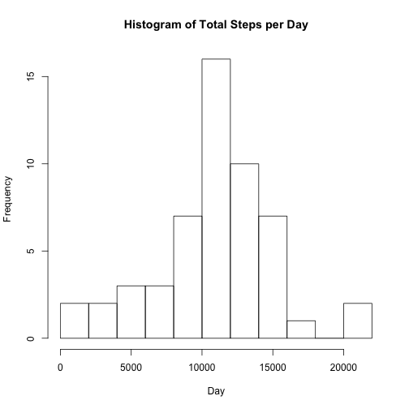
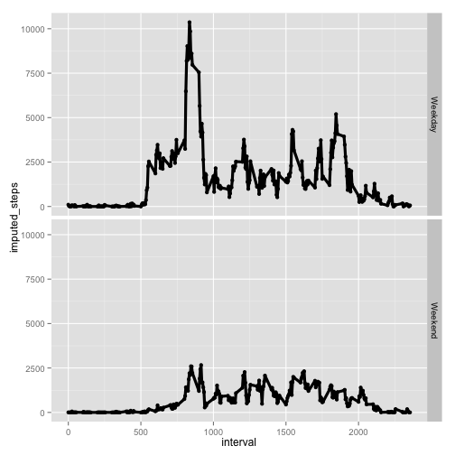
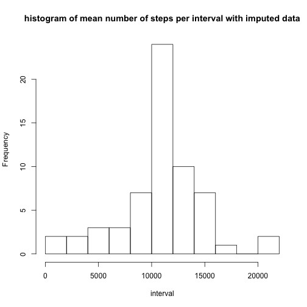

## Loading and preprocessing the data
setwd("~/Coursera/RD_PA1/RepData_PeerAssessment1")

```r
library(downloader)
library(dplyr)
library(plyr)
library(reshape2)
url <-'https://d396qusza40orc.cloudfront.net/repdata%2Fdata%2Factivity.zip'
# download and unzip data from source
download(url, dest="activity.zip", mode="wb") 
unzip ("activity.zip", exdir = "./")
# read in data
data <- read.csv('activity.csv',header=TRUE)
# remove missing step entries
cleandata <- filter(data,is.na(steps)==FALSE)
meltdata <- melt(cleandata,id.vars =c('date','interval'), measure.vars = 'steps' )
```

## What is mean total number of steps taken per day?

```r
# calculate table of total number of steps per day
datesteps <- dcast(meltdata,date~variable,sum)
# make a histogram of the daily steps
hist(datesteps[,2],breaks = 15, main = 'Histogram of Total Steps per Day',xlab = 'Day')
```

 

```r
dev.copy(png,'histplot1.png')
```

```
## quartz_off_screen 
##                 5
```

```r
dev.off()
```

```
## RStudioGD 
##         2
```

```r
# calculate the mean number of steps per day
mean(datesteps[,2])
```

 

```
## [1] 10766.19
```

```r
# calculate the median number of steps per day
median(datesteps[,2])
```

```
## [1] 10765
```

## What is the average daily activity pattern?

```r
intervalsteps <- dcast(meltdata,interval ~ variable, mean)

plot(intervalsteps,type = 'l',xlab = 'Interval',main = 'Histogram of mean number of steps per interval')
```

 

```r
# determine which interval contains the maximum average number of steps
intervalsteps[which.max(intervalsteps[,2]),]
```

```
##     interval    steps
## 104      835 206.1698
```

## Imputing missing values

```r
# calculate number of rows with NA
narows <- filter(data, !complete.cases(data))
nrow( narows)
```

```
## [1] 2304
```

```r
# loop through data vector and replace NA in 'steps' with mean steps/day for given interval

intervalsteps <- dcast(meltdata,interval ~ variable, mean)
# find average steps for each row in data and add as new column to dataframe
vals2 <- cbind(data,imputedata = ldply(data[,'interval'],function(x) intervalsteps[match(x,intervalsteps[,'interval']),'steps']))
# loop through list of steps and replace with average steps for that interval if the value of steps is NA
v5<- apply(vals2,1,function(x) replace(as.numeric(x[1]),is.na(as.numeric(x[1])),as.numeric(x['V1'])))
# add imputed data as new column to data set
v6 <- cbind(vals2,imputed_steps = v5)


meltdataimpute <- melt(v6,id.vars =c('date','interval'), measure.vars=c('steps','imputed_steps'))
datestepsimpute <- dcast(meltdataimpute,date ~ variable, sum)
hist(datestepsimpute[,3],breaks=15,xlab = 'interval', main = 'histogram of mean number of steps per interval with imputed data')
```

 

```r
#compare mean and median values of imputed data
print(mean(datesteps[,2]) < mean(datestepsimpute[,3]))
```

```
## [1] FALSE
```

```r
print(median(datesteps[,2])  < median(datestepsimpute[,3]))
```

```
## [1] TRUE
```
## Are there differences in activity patterns between weekdays and weekends?

```r
library(lubridate)
library(ggplot2)
#calculate and label which days are weekend and weekdays
daytype <- factor(wday(data[,2]),labels = c('Weekend','Weekday','Weekday','Weekday','Weekday','Weekday','Weekend'))
```

```
## Warning in `levels<-`(`*tmp*`, value = if (nl == nL) as.character(labels)
## else paste0(labels, : duplicated levels in factors are deprecated
```

```r
# add factor variable to data set
v8 <- cbind(v6,dow = daytype)
# compare total number of steps between weekdays and weekends across daily interval
meltday <- melt(v8,id.vars= c('date','interval','dow'),measure.vars = 'imputed_steps')
dowmelt <- dcast(meltday,dow +interval ~ variable, sum)
```

```
## Warning in `levels<-`(`*tmp*`, value = if (nl == nL) as.character(labels)
## else paste0(labels, : duplicated levels in factors are deprecated
```

```r
qplot(interval,imputed_steps, data = dowmelt, facets = dow~.)+geom_line(size=1.5) 
```

```
## Warning in `levels<-`(`*tmp*`, value = if (nl == nL) as.character(labels)
## else paste0(labels, : duplicated levels in factors are deprecated
```

```
## Warning in `levels<-`(`*tmp*`, value = if (nl == nL) as.character(labels)
## else paste0(labels, : duplicated levels in factors are deprecated
```

 
